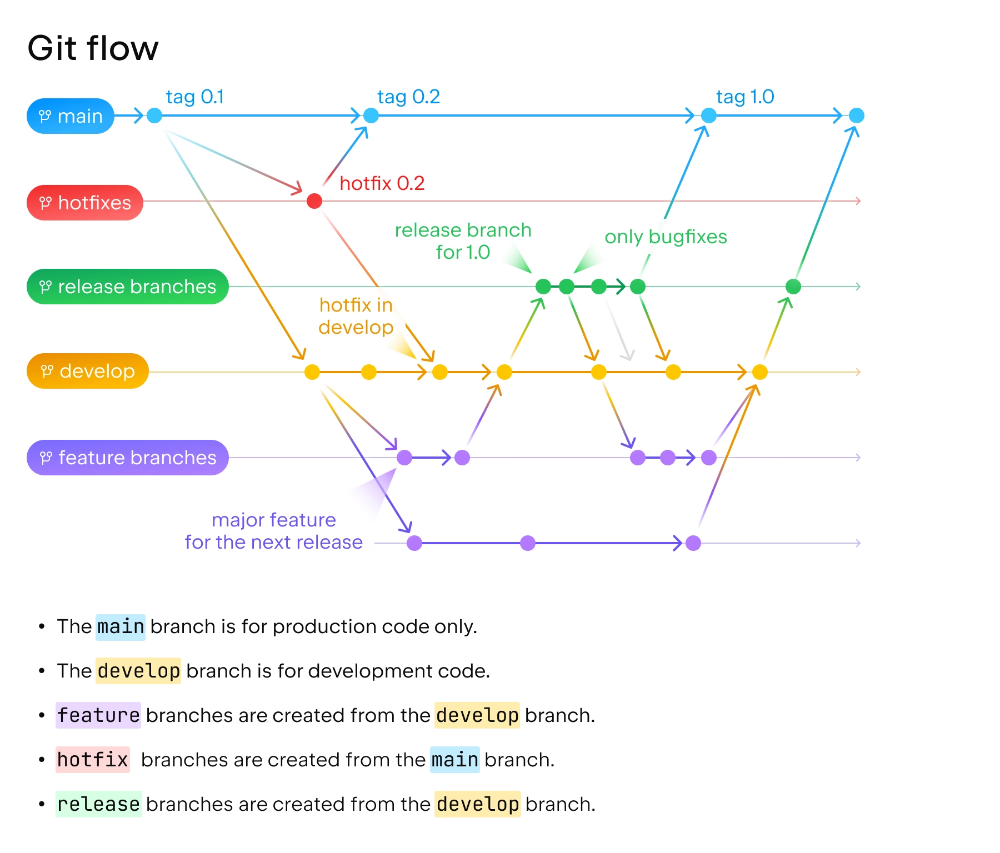

# 📈 Stock Market Prediction Platform

Este proyecto tiene como objetivo predecir el precio de las acciones de NVIDIA (u otro stock) mediante un pipeline completo basado en web scraping, análisis de sentimientos con LLMs y modelos de series temporales.

1. Scrapea la web para extraer información financiera y noticias relevantes del mercado.
2. Guarda la información en una base de datos PostgreSQL.
3. Vectoriza el contenido textual y lo analiza mediante un modelo de lenguaje (LLM).
4. Clasifica y analiza el sentimiento de las noticias extraídas.
5. Combina el histórico de precios con los resultados del análisis de sentimiento para generar features y entrenar modelos de predicción del precio de NVIDIA.

```bash
.
├── Diagrama.drawio
├── README.md
├── backend/
│   ├── api/
│   ├── orchestrator/
│   ├── pipelines/
│   │   ├── forecasting/
│   │   ├── llm_sentiment_analysis/
│   │   └── web_scraper/
│   └── requirements.txt
├── database/
│   └── Dockerfile
└── frontend/
```

## ⚙️ Tecnologías utilizadas
- Python 3.11
- FastAPI
- PostgreSQL
- Groq/LLaMA (u otro LLM local) (por definir)
- Scikit-learn / Prophet / LSTM (por definir)
- Docker
- Frontend (por definir)
- GitHub Actions pra CI/CD
- MLflow, para registrar el modelo

## 🔄 Funcionamiento del Flujo
- **Web Scraper (pipelines/web_scraper):** extrae artículos y datos desde medios financieros, los limpia y guarda en la base de datos.
- **Sentiment Analysis (pipelines/llm_sentiment_analysis):** vectoriza los textos mediante embeddings, los analiza con un LLM y guarda las etiquetas de sentimiento.
- **Forecasting (pipelines/forecasting):** une el histórico financiero con el sentimiento, crea features y entrena modelos de series temporales para realizar predicciones.
- **Orchestrator (backend/orchestrator):** coordina la ejecución secuencial de los pasos anteriores, puede integrarse con cron o ejecutarse desde la API.
- **Frontend (frontend/):** visualiza los datos, resultados de análisis y predicciones a través de una interfaz web conectada con la API REST.

## 🌱 Flujo de Trabajo: GitFlow
Se sigue la estrategia GitFlow para gestionar el trabajo colaborativo.



**Ramas principales**

- **main:** rama estable en producción.
- **develop:** rama principal de desarrollo.

**Ramas auxiliares**

- **feature/\<nombre>:** nuevas funcionalidades que serán *merged* a *develop*.
- **release/v\<x.y>:** ramas donde la aplicación se usará y se quedará estable en producción (equivalente a PRO). Las ramas de release nacen directamente (*branch out*) desde *main*.
- **hotfix/\<nombre>:** arreglos urgentes sobre main.
  

## 👥 Contribución

- Crea ramas feature/ desde develop.
- Aplica buenas prácticas de codificación.
- Cubre tu código con tests.
- Añade etiquetas a tus commits:
  - `[ADD]` para nuevas funcionalidades.
  - `[EDIT]` para modificaciones o mejoras en funcionalidades existentes.
  - `[FIX]` para corrección de errores o bugs.
- Realiza Pull Requests descriptivos.